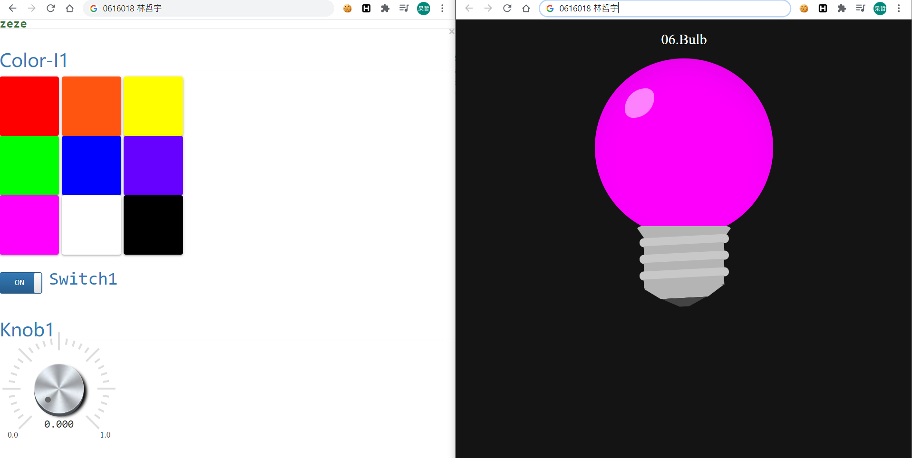

# HW0
## 地一部分 - 自我介紹
大家好，我是交大資工系林哲宇，網路上常用的 id 是 zeze，平常有在打 CTF，所以較多接觸資安方面。之前有修過校際中開的 [Python與物聯網資料分析](https://github.com/zeze-zeze/PythonIOT)，也有修過資工的選修[物聯網概論](https://github.com/zeze-zeze/IoT_final)，請大家多多指教！

## 第二部分 - IOTtalk 練習
1. 透過 Remote Control 的 knob 和 switch 控制燈泡的 Luminance

2. 透過 Remote Control 的 color 控制燈泡的 color

3. 更改 function

4. 同時透過三個 knob 控制燈泡的 color

## 第三部分 - IOTtalk 心得
部分的功能之前修的課堂上有做過，不過忘得差不多了，藉著這次 HW0 回復一下記憶，也期望之後可以做出更有趣的應用
