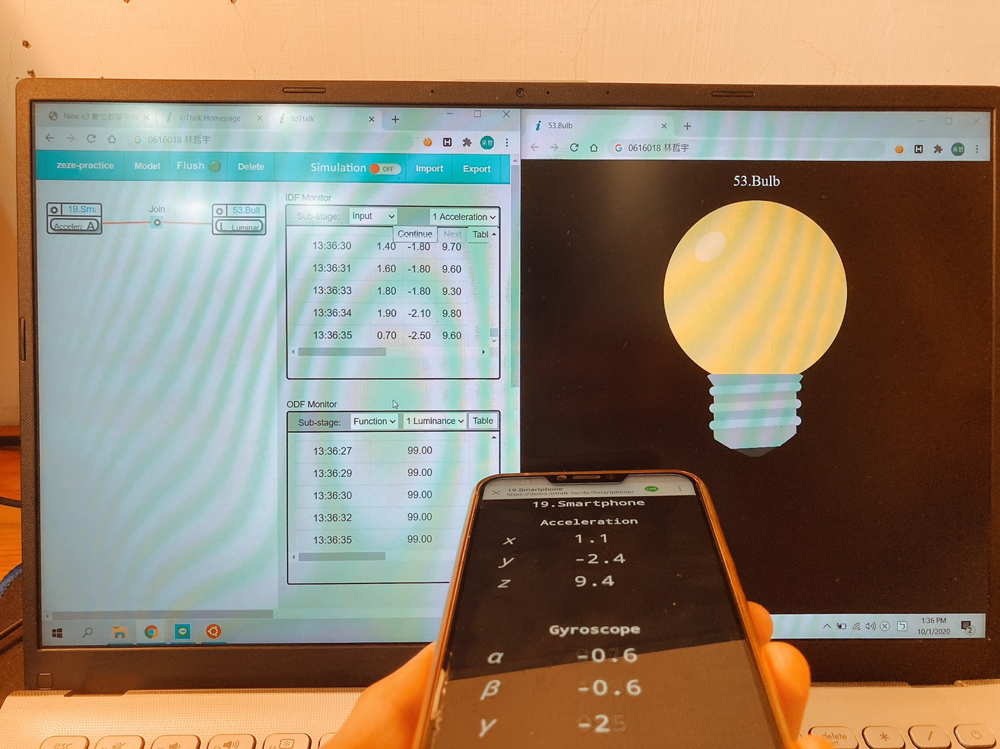

# HW1
## 練習心得
這系統太毒了，常常明明東西沒接錯，程式也沒寫錯，但是結果卻不同，最後才想起來那個 Join 要重新砍掉重接。還有裡面的 model 的值是大家都能改的，被改成什麼樣都不知道，每次要做的時候都要重新確認一遍它原本是什麼。有股想要自己把這系統架起來的衝動了。

## 截圖們
1. 首先把線接好，裝置也都對應好

2. Min 設 0，Max 設 99，function 設 Disable

3. 寫個 function，如果手機朝上，Z 軸會是正值，所以會 return 99；反之 return 0

4. 手機朝上

5. 手機朝下

## 拍照
1. 手機朝上

2. 手機朝下

