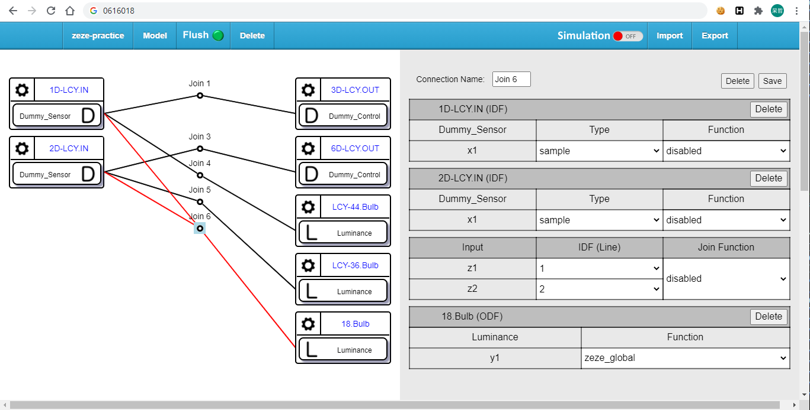
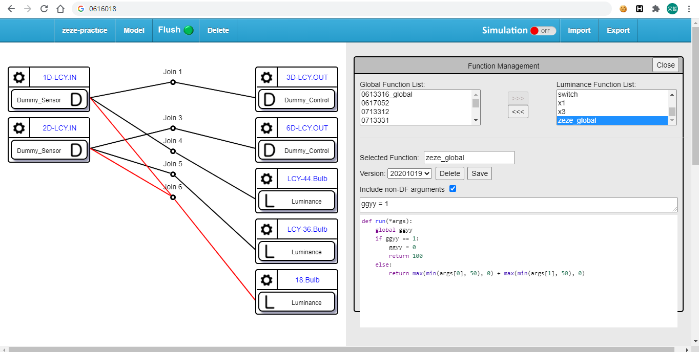
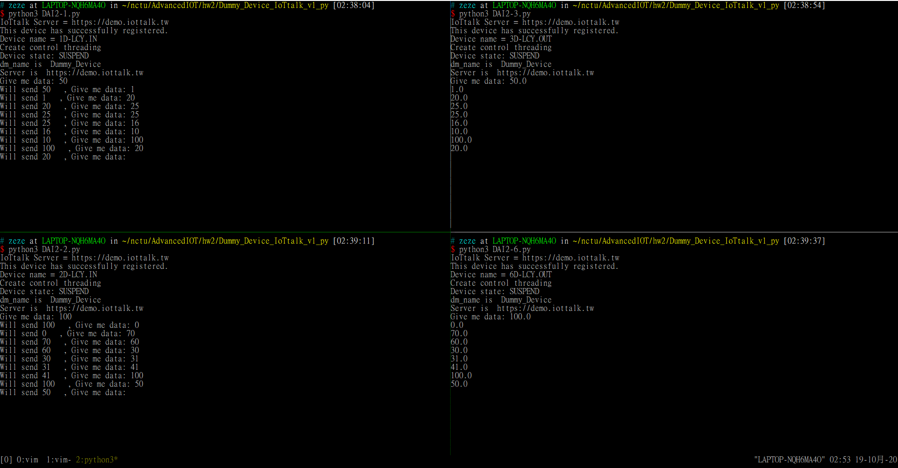
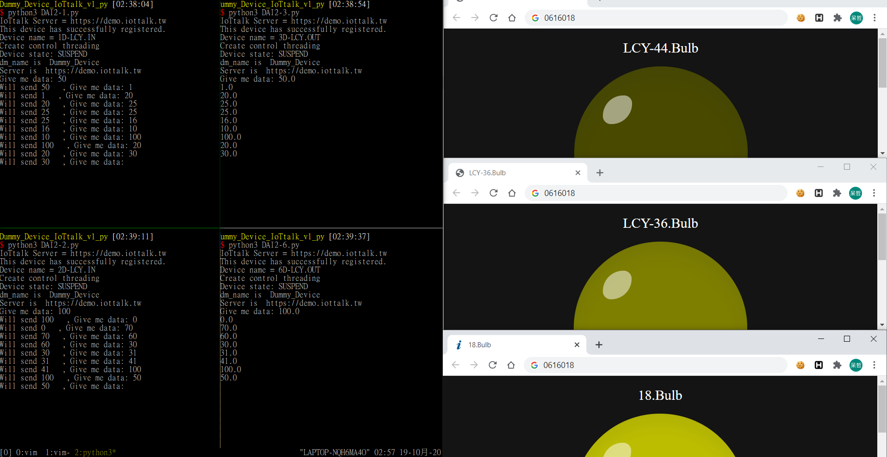
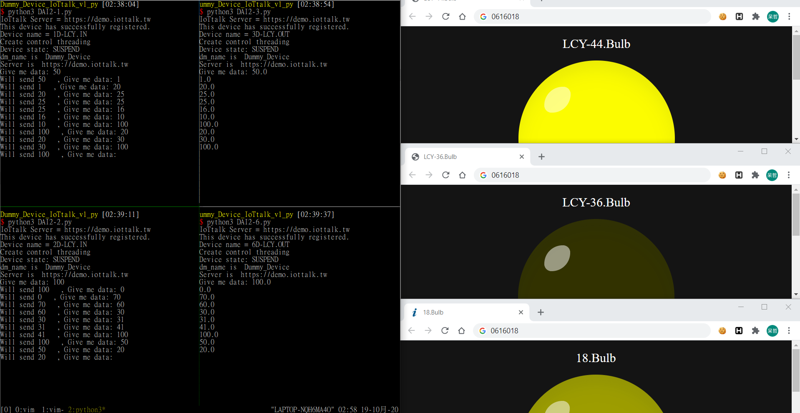
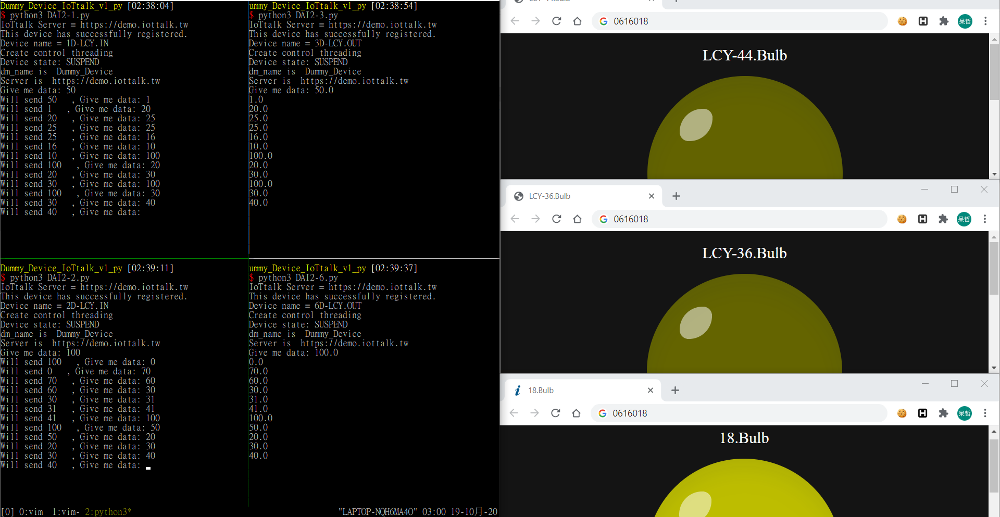

# Week 5 練習題
* 學號: 0616018
* 姓名: 林哲宇

## 心得
這個作業來得快去得也快，deadline 前一天才發現這個作業，趕快花些時間弄完。整體來說就是 Device 透過 Server 戳自己的 Device、Device 戳 Server、Device 透過 Server 戳自己的燈泡。寫 function 的部分多學到了 使用 global variable，就醬。

## 截圖
1. Project 接線圖與使用 joint function

2. Project 接線圖與 joint function 實作

3. 1D 和 2D 的 device 分別對應到 3D 和 6D 的 device

4. 1D 控制的 data 輸入 30，對應右邊最暗的燈泡(LCY-44.Bulb) ; 2D 控制的 data 輸入 50，對應右邊次暗的燈泡(LCY-36.Bulb) ; 右邊最亮的燈泡是兩個加起來的結果(18.Bulb)

5. 1D 控制的 data 輸入 100，對應右邊最亮的燈泡(LCY-44.Bulb) ; 2D 控制的 data 輸入 20，對應右邊最暗的燈泡(LCY-36.Bulb) ; 右邊次亮的燈泡因為 1D 超過 100 所以算 50，因此亮度只有 70 (18.Bulb)

6. 1D 和 2D 控制的 data 同時輸入 40，對應右邊次暗的燈泡(LCY-44.Bulb, LCY-36.Bulb) ; 右邊最亮的燈泡是兩個加起來的結果 (18.Bulb)

