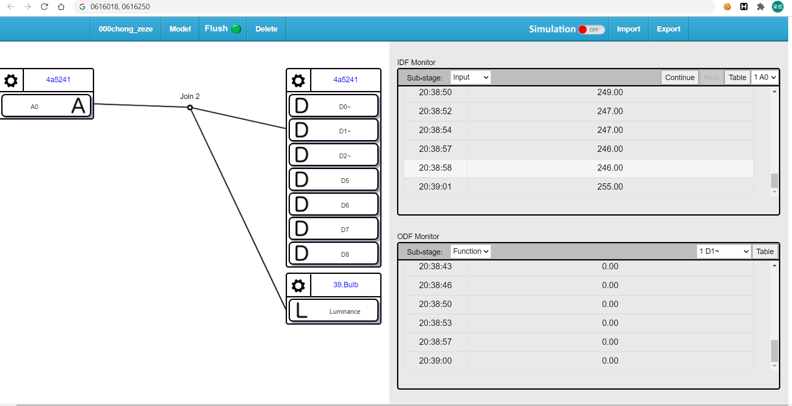
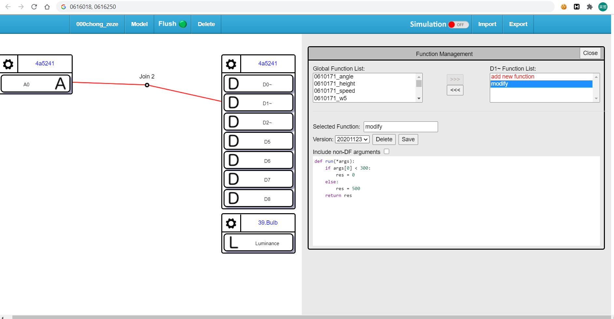
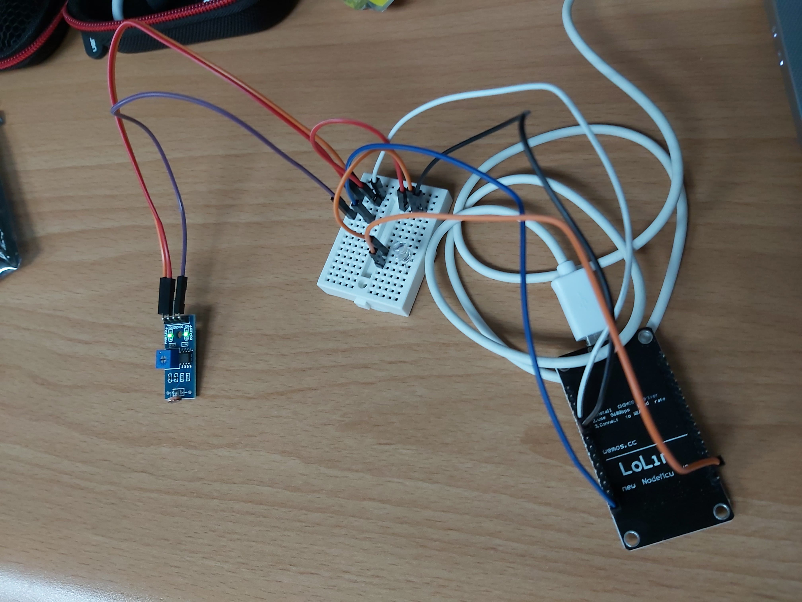
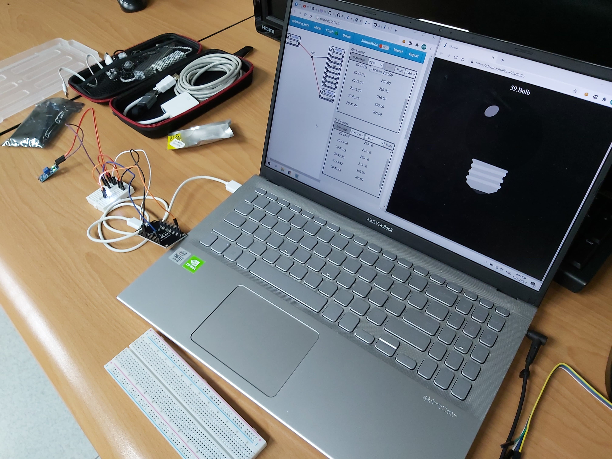
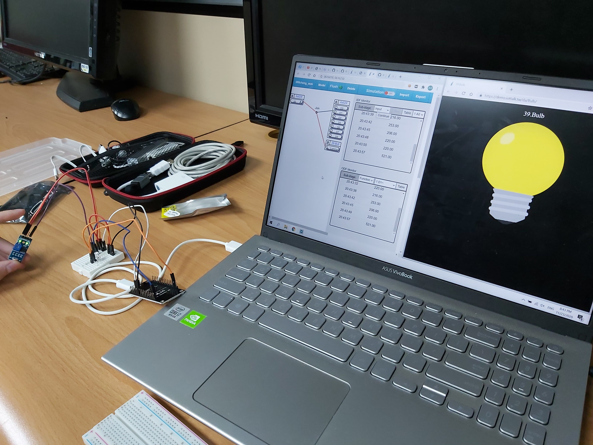

# Week09
## 隊伍資訊
* 0616018 林哲宇
* 0616250 張惠恩

## 截圖
1. 連接好的 iottalk 連接圖

2. 其中寫一個小 function 去調整亮度

3. 這是 NodeMCU 的線路

4. 這是當周圍是亮的時候的情形

5. 這是當周圍是暗的時候的情形(用手指把感測器遮住)

## 心得
做完這個稍微學到 ESP8266 的使用方法，還有應用自己接線路連上 iottalk
* [youtube 連結](https://www.youtube.com/watch?v=XoLeuLdXoL0&feature=youtu.be)
