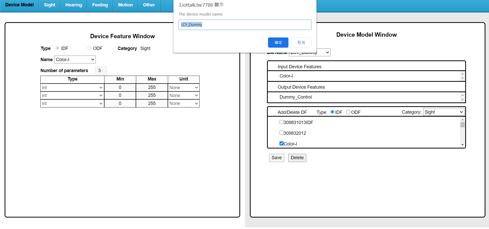

# Week11
* 0616018 林哲宇

## 心得
這次作業做得挺快的，還好不用把影片看完就能做了。遇到一個坑是寫作業的時候忘記 DAI 不能用 WSL 跑而要用 cmd 才能跑，下次要記得。

## 截圖們
1. 自己創的 dummy device 設了兩個變數，Color-I 和 Dummy_sensor

2. 接線圖長這樣

3. code 部分我把 theInput 變成一個 list，然後在 DAN.push 時把 theInput 各項填進去

4. 輸入 r 200, g 200, b 200, lum 100 時

5. 輸入 r 100, g 100, b 100, lum 100 時

6. 輸入 r 50, g 150, b 250, lum 100 時

7. 輸入 r50, g 150, b 250, lum 50 時

