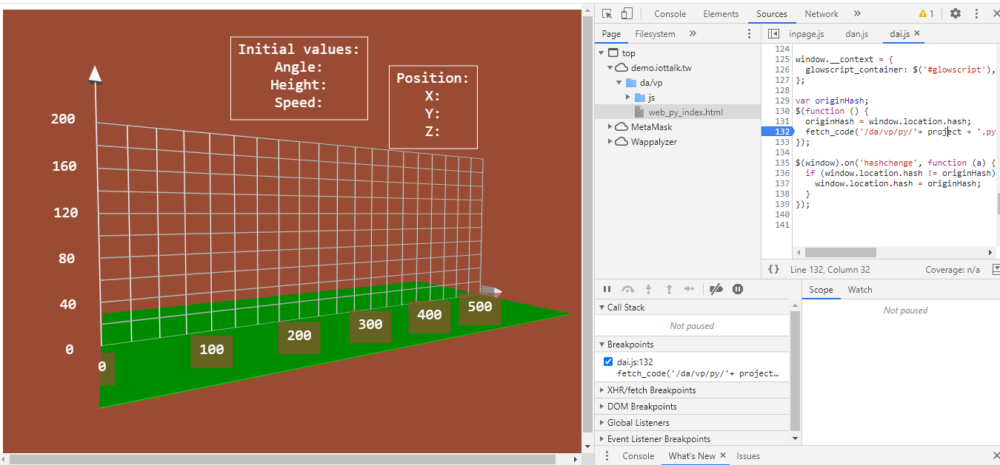

# Week15
* 姓名: 林哲宇
* 學號: 0616018

## 截圖
1. 先從 demo.iottalk.tw 的 Ball-throw1 抓檔案

2. 改抓下來的 html 檔案，把路徑改成 server 或 local 的

3. 從教學網站複製下來 Ball-throw1.py 後，點開 html 檔案

4. 開始接連接圖

5. 弄 Dummy Device，每次接收一個數字

6. 改 speed，這邊輸入 30，右邊顯示 40 的原因可能為 iottalk 會自己做 mapping。輸入 26 則右邊會顯示 34

7. 改 keypad 可以改角度

8. 改 knob 可以改高度

## 心得
這次的作業讓我從網站上抓了資源，之後自己東改西改，弄成 local 的 Ball-throw，另外也用了之前作業用到的 dummy device。感謝老師終於換麥克風了，不然耳多以前感覺在被霸凌。
